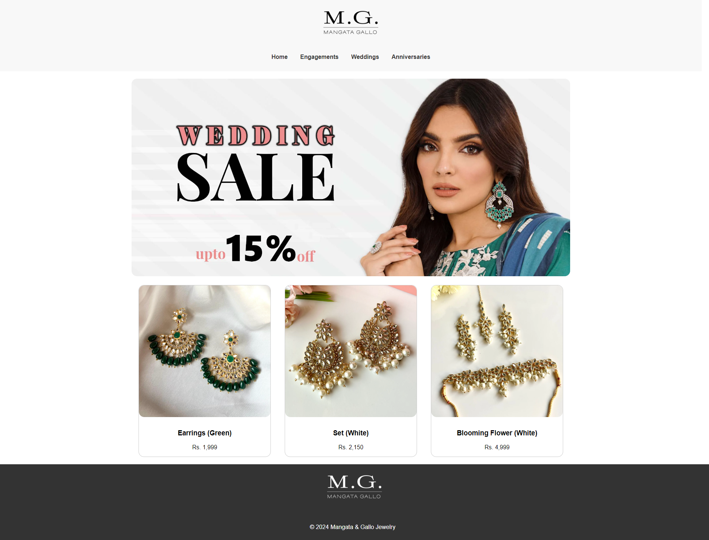

# Meta Project for Luxury Jewelry: Mangata and Gallo

Welcome to Mangata & Gallo Jewelry – where elegance meets craftsmanship. This project showcases a beautifully designed HTML website for a fictional jewelry brand specializing in engagements, weddings, and anniversaries.

---

## Table of Contents
- [Preview](#preview)
- [Usage](#usage)
- [Features](#features)
- [License](#license)

## Preview

## Usage
Live Preview: [View on Vercel](https://meta-project-course-3-n4q7rfm3i-asadamyn.vercel.app/)

## Features
- **Responsive Design:** The website is designed to be fully responsive, ensuring a seamless experience across various devices.
- **Navigation:** Easy navigation with a clean and intuitive menu structure for Home, Engagements, Weddings, and Anniversaries.
- **Promo Section:** A visually appealing promotional section showcasing exquisite jewelry pieces.
- **Latest Products:** Highlighting the latest jewelry products with images, names, and prices.

## License
This project is licensed under the [MIT License](LICENSE).

---
